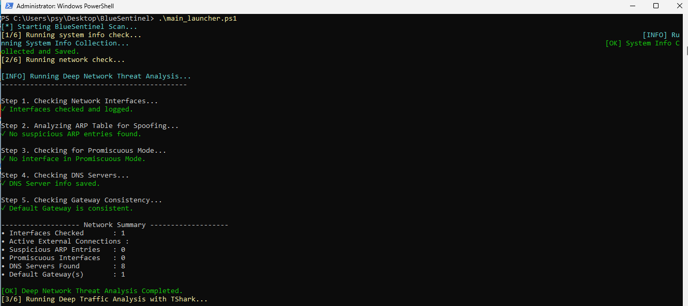
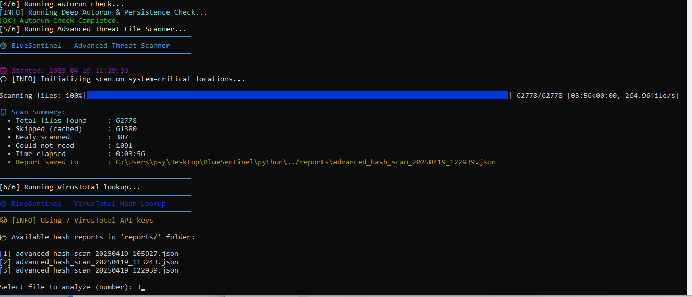
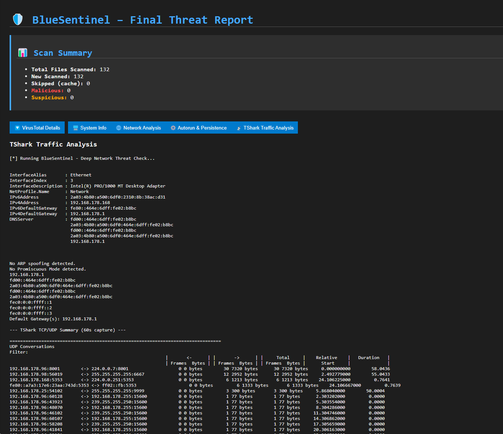

# 🔵 BlueSentinel

**BlueSentinel** is a modular, script-based threat detection toolkit designed for Windows systems.  
It provides in-depth system and network analysis, threat hunting capabilities, and centralized reporting — all with zero bloat and maximum control.

Developed with passion and precision by [Valon Canolli](https://github.com/ValonCanolli), BlueSentinel is aimed at Blue Teamers, SOC analysts, and cybersecurity professionals.

---

## 🖼️ Screenshot Preview

  
  


---

## ⚙️ Core Features

### 🔐 System Analysis
- ✅ Full system info dump (OS, BIOS, HW, user)
- ✅ Autorun & persistence detection (Win32_StartupCommand)

### 🌐 Network Threat Detection
- ✅ Interface, DNS, gateway inspection
- ✅ ARP spoofing & MITM detection
- ✅ Promiscuous mode detection (NIC sniffing)
- ✅ Deep traffic analysis with TShark (TCP/UDP conv.)
- ✅ Beaconing & C2 traffic anomaly detection

### 🔥 File & Threat Scanning
- ✅ Hash-based scanning of critical folders
- ✅ VirusTotal integration (API key rotation)
- ✅ Smart cache (skips rescanned files within 7 days)
- ✅ Threat classification: malicious, suspicious, clean

### 📊 Reporting & Automation
- ✅ Interactive HTML reports with toggleable sections
- ✅ CLI-friendly, scriptable, modular structure
- ✅ Works offline (basic modules) & ready for SIEM


---

## 🧱 Project Structure

```
BlueSentinel/
├── powershell/
│   ├── sysinfo_check.ps1
│   ├── network_check.ps1
│   ├── tshark_capture.ps1
│   ├── autorun_check.ps1
├── python/
│   ├── Advanced_Threat_File_Scanner.py
│   ├── virustotal_lookup.py
│   ├── html_report_generator.py
├── config/
│   └── api_keys.json (NOT INCLUDED - create your own)
├── reports/
├── cache/
├── screenshots/
├── main_launcher.ps1
├── README.md
├── LICENSE
```

---

## 🚀 Getting Started

### 🔧 Requirements:
- PowerShell 5.1+
- Python 3.10+
- pip install -r requirements.txt (colorama, tqdm, requests)
- Optional: tshark (Wireshark CLI)

### ▶️ To Run Full Scan:
```bash
.\main_launcher.ps1
```

---

## 🔑 API Keys

Create a file `config/api_keys.json`:
```json
{
  "openai": {
    "api_key": "YOUR_OPENAI_KEY"
  },
  "virustotal": {
    "api_keys": ["KEY1", "KEY2"]
  },
  "abuseipdb": {
    "api_key": "YOUR_ABUSEIPDB_KEY"
  },
  "shodan": {
    "api_key": "YOUR_SHODAN_KEY"
  }
}
```

---

## 📄 Example Final Report

HTML report will be saved to:
```
/reports/BlueSentinel_Report_<TIMESTAMP>.html
```

Includes:
- Detected threats
- VirusTotal results
- Traffic anomalies
- Full forensic overview

---

## 📜 License

This project is licensed under the MIT License — see the [LICENSE](LICENSE) file for details.

---

## 👤 Author

Developed by **Valon Canolli**  
Cybersecurity Engineer | Blue/Red Team Lead | Threat Hunter
---

## ⚠️ Troubleshooting & Notes

### 🔐 PowerShell Execution Policy
If you encounter an error like:
```
script.ps1 cannot be loaded because running scripts is disabled on this system.
```

Run this command to allow script execution temporarily:
```powershell
Set-ExecutionPolicy -Scope Process -ExecutionPolicy Bypass -Force
```

This allows all PowerShell scripts in BlueSentinel to run without modifying global policy.

---

### 📝 File Encoding Issues
If any script fails to run or displays unusual characters, do the following:

1. Open the script in **Notepad++**
2. Go to the top menu → `Encoding` → `Convert to UTF-8-BOM`
3. Save and re-run the script

> All BlueSentinel scripts are designed to work with UTF-8-BOM encoding.
